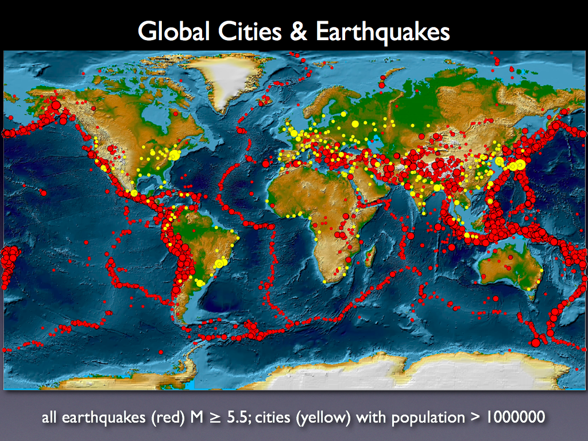
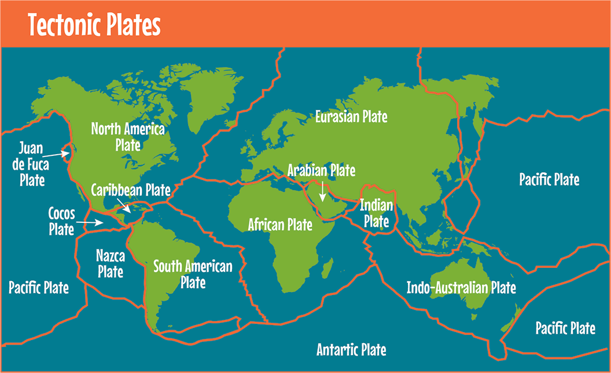

<div align="center">

</div>

> <p dir="RTL"> 
با استفاده از داده های زلزله ها در ایران و جهان به سوالات زیر پاسخ دهید.
</p>

در اینجا پردازش های اولیه و توابع پراستفاده را می نویسیم.
</p>


```{r 0, echo=TRUE, fig.height=9, fig.width=16, message=FALSE, warning=FALSE, code=readLines("./../Solutions/0.R"), paged.print=FALSE}
```

```{r theme, message=FALSE, warning=FALSE, code=readLines("./../Solutions/theme.R"), include=FALSE, paged.print=FALSE}
```

***

<p dir="RTL">
۱. با استفاده از داده های
historical_web_data_26112015.rds 
و استفاده از نمودار پراکنش سه بعدی بسته plotly نمودار طول، عرض و عمق زلزله ها را رسم نمایید. علاوه بر آن بزرگی هر نقطه را برابر بزرگی زمین لرزه قرار دهید.
</p>

```{r 1, echo=TRUE, fig.height=9, fig.width=16, message=FALSE, warning=FALSE, code=readLines("./../Solutions/1.R"), paged.print=FALSE}
```

***

<p dir="RTL">
۲. پویانمایی سونامی های تاریخی را بر حسب شدت بر روی نقشه زمین رسم نمایید.(از داده زلزله های بزرگ استفاده نمایید.)
</p>

<p dir="RTL">
تابع نوشته شده در زیر در ابتدا کار می کرد ولی پس از آپدیت پکیج دیگر کار نمی کرد، فایل گیف قبلی در کنار فایل اچ تی ام ال موجود است.
</p>

```{r 2, echo=TRUE, fig.height=9, fig.width=16, message=FALSE, warning=FALSE, code=readLines("./../Solutions/2.R"), paged.print=FALSE}
```


***

<p dir="RTL">
۳. نمودار چگالی دو بعدی زلزله های تاریخی ایران را رسم کنید.( از داده iran_earthquake.rds و لایه stat_density_2d استفاده نمایید).
</p>


```{r 3, echo=TRUE, fig.height=9, fig.width=16, message=FALSE, warning=FALSE, code=readLines("./../Solutions/3.R"), paged.print=FALSE}
```


***

<p dir="RTL">
۴. احتمال اینکه در ایران در پنج سال آینده زلزله به بزرگی هفت ریشتر رخ دهد را محاسبه کنید. (از احتمال شرطی استفاده کنید.)
</p>


```{r 4, echo=TRUE, fig.height=9, fig.width=16, message=FALSE, warning=FALSE, code=readLines("./../Solutions/4.R"), paged.print=FALSE}
```


***

<p dir="RTL">
۵. بر اساس داده های زلزله های بزرگ ابتدا تعداد و متوسط کشته زلزله ها را بر حسب کشور استخراج نمایید. سپس نمودار گرمایی تعداد کشته ها را بر روی کره زمین رسم نمایید.(مانند مثال زیر!)
</p>


<div align="center">

</div>


```{r 5, echo=TRUE, fig.height=9, fig.width=16, message=FALSE, warning=FALSE, code=readLines("./../Solutions/5.R"), paged.print=FALSE}
```


***

<p dir="RTL">
۶. با استفاده از داده لرزه های بزرگ و به وسیله طول، عرض، شدت، عمق مدلی برای پیش بینی تعداد کشته های زلزله بیابید.
</p>


```{r 6, echo=TRUE, fig.height=9, fig.width=16, message=FALSE, warning=FALSE, code=readLines("./../Solutions/6.R"), paged.print=FALSE}
```


***

<p dir="RTL">
۷. با استفاده از داده worldwide.csv به چند سوال زیر پاسخ دهید. تحقیق کنید آیا می توان از پیش لرزه، زلزله اصلی را پیش بینی کرد؟
</p>

<p dir="RTL">
زلزله ها را برحسب درجات آن ها در بازه های ۳ تایی تقسیم می کنیم. در این بازه ها اولین زلزله و بزرگترین زلزله را به دست می آوریم.
سپس توزیع فواصل این ۲ را هم به دست می آوریم تا ببینیم آیا توزیع خوبی دارد یا نه.
با کشیدن توزیع آن می بینیم که توزیع جالبی ندارد و حتی یکنوا هم نیست توزیع آن.
پس بنابراین نمی توان از روی پیش لرزه پس لرزه را پیش بینی کرد ولی می توان حدودی را داشت.
</p>

```{r 7, echo=TRUE, fig.height=9, fig.width=16, message=FALSE, warning=FALSE, code=readLines("./../Solutions/7.R"), paged.print=FALSE}
```


***

<p dir="RTL">
۸. گزاره " آیا شدت زلزله به عمق آن بستگی دارد" را تحقیق کنید؟ (طبیعتا از آزمون فرض باید استفاده کنید.)
</p>


<p dir="RTL">
از تست کریلیشن اسپیرمن استفاده می کنیم و می بینیم که اندکی تاثیر مثبت دارد.
</p>


```{r 8, echo=TRUE, fig.height=9, fig.width=16, message=FALSE, warning=FALSE, code=readLines("./../Solutions/8.R"), paged.print=FALSE}
```


***

<p dir="RTL"> 
۹. میانگین سالانه زلزله ها را بر حسب کشور به دست آورید. آیا میتوان دلیلی در تایید یا رد تئوری هارپ ارائه کرد.
</p>

<p dir="RTL"> 
ابتدا تعداد زلزله های در هر کشور را با ۲ راه یکی با بررسی ستون مکان و سپس هم با بررسی کشوری که زلزله در محیط بسته ی آن رخ داده اندازه می گیریم.
</p>

<p dir="RTL"> 
در نهایت هم می بینیم که با مقایسه ی صفحات تکتونیک زمین و جاهایی که زلزله رخ داده است دلیلی برای قبول کردن تئوری هارپ وجود ندارد و اکثر زلزله ها همانطور که انتظار می رود روی صفحات تکتونیک هستند.
</p>

```{r 9, echo=TRUE, fig.height=9, fig.width=16, message=FALSE, warning=FALSE, code=readLines("./../Solutions/9.R"), paged.print=FALSE}
```


<div align="center">

</div>


***

<p dir="RTL"> 
۱۰. سه حقیقت جالب در مورد زلزله بیابید.
</p>


<p dir="RTL"> 
حقیقت اول: سونامی ها بیشتر از غیر سونامی ها آدم می کشند.
</p>

<p dir="RTL"> 
حقیقت دوم: کشنده ترین زمین لرزه های دوقلو، یعنی زمین لرزه های بزرگی که با فواصل کم رخ داده اند کدامند؟
</p

<p dir="RTL"> 
کشور های با جمعیت بیشتر زلزله ی بیشتری دارند.
</p>

```{r 10, echo=TRUE, fig.height=9, fig.width=16, message=FALSE, warning=FALSE, code=readLines("./../Solutions/10.R"), paged.print=FALSE}
```


