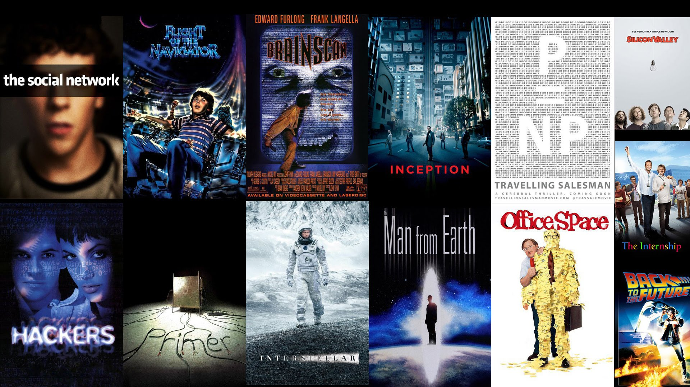

<div align="center">

</div>

> <p dir="RTL"> 
با استفاده از داده نظرهای فیلم به سوالات زیر پاسخ دهید.
</p>

در اینجا پردازش های اولیه و توابع پراستفاده را می نویسیم.
</p>


```{r 0, echo=TRUE, fig.height=9, fig.width=16, message=FALSE, warning=FALSE, code=readLines("./../Solutions/0.R"), paged.print=FALSE}
```

```{r theme, message=FALSE, warning=FALSE, code=readLines("./../Solutions/theme.R"), include=FALSE, paged.print=FALSE}
```


***

<p dir="RTL">
۱. آماره های زیر را بیابید.
الف. محبوب ترین فیلم کدام است؟
ب. بیشترین نظرات درباره چه فیلمی داده شده است؟
پ. منفورترین فیلم کدام است؟
ت. تعداد فیلم های ساخته شده در هر سال
ث. در هر سالی مردم به چه ژانری علاقه مند بوده اند.
</p>

```{r 1, echo=TRUE, fig.height=9, fig.width=16, message=FALSE, warning=FALSE, code=readLines("./../Solutions/1.R"), paged.print=FALSE}
```

***

<p dir="RTL">
۲. ژانر فیلم ها را استخراج نمایید.  سپس آماره های زیر را استخراج نمایید.
الف. نمودار ستونی تعداد فیلم های هر ژانر
ب. نمودار همبستگی ژانرها
پ. متوسط امتیاز به هر ژانر
ت. دوران طلایی فیلم سازی 
</p>

```{r 2, echo=TRUE, fig.height=9, fig.width=16, message=FALSE, warning=FALSE, code=readLines("./../Solutions/2.R"), paged.print=FALSE}
```
***

<p dir="RTL">
۳. نمودار ابر لغات را بر حسب کلمات عنوان فیلم ها رسم نمایید.
</p>


```{r 3, echo=TRUE, fig.height=9, fig.width=16, message=FALSE, warning=FALSE, code=readLines("./../Solutions/3.R"), paged.print=FALSE}
```
***

<p dir="RTL">
۴. با استفاده از قوانین همبستگی یک توصیه گر برای فیلم ها بسازید. شبیه ترین فیلم ها به لیست زیر را پیدا کنید.
</p>

* Castle in the Sky (1986)
* Cast Away (2000)
* No Country for Old Men (2007)
* Memento (2000)

```{r 4, echo=TRUE, fig.height=9, fig.width=16, message=FALSE, warning=FALSE, code=readLines("./../Solutions/4.R"), paged.print=FALSE}
```

***

<p dir="RTL">
۵. تمرین سخت: در گیت هاب برای خود اکانت درست کنید. همه تمرین های خود را آنجا بارگذاری کنید! و لینک آن را ارسال نمایید.
</p>

https://github.com/Mahbodmajid/DataAnalysis

***

<p dir="RTL">
۶. پنج انتقاد از درس و نحوه تدریس را بیان کنید.
</p>

<p dir="RTL">
۱. بیش از اندازه عملی بود و می شد تئوری آن بیشتر باشد.
</p>

<p dir="RTL">
۲. سنگینی تمارین به حدی بود که آدم می تونست فقط همین یه درس رو توی ترم داشته باشه عملن :))
</p>

<p dir="RTL">
۳. به نظرم پروژه ها خیلی بار آموزشی ای نخواهند داشت برای دانشجویان و تمارین برای یادگیری مسائل بررسی شده در کلاس کافی اند.
</p>

<p dir="RTL">
۴. نمرات تمارین بهتر بود در طی ترم داده می شدند تا متوجه اشکالاتمان بشویم.
</p>

<p dir="RTL">
۵. تمارین درس از جایی به بعد کاملن شکل یک نواخت و تکراری ای به خود گرفته بودند.
</p>

***

<p dir="RTL">
۷. پنج پیشنهاد برای بهتر شدن درس بیان کنید.
</p>

<p dir="RTL">
۱. به تئوری بیشتر پرداخته شود.
</p>

<p dir="RTL">
۲. روش های ماشین لئرنینگی هم درس داده شوند.
</p>

<p dir="RTL">
۳. با توجه به فراگیرتر شدن پایتون در مقابل آر شاید بهتر باشه مقداری هم از مقدمات کار با داده در پایتون هم گفته شود.
</p>

<p dir="RTL">
۴. داده های مسابقات کگل هم در کلاس آورده شوند برای کار با داده های به روز و واقعی تر.
</p>

<p dir="RTL">
۵. داده های خیلی کثیف هم برای اینکه بالاخره یک بار با این داده ها هم برخورد کنیم داده شوند.
</p>

***

<p dir="RTL">
۸. سه موضوع آماری جدید برای جایگزینی در سرفصل ها پیشنهاد دهید.
</p>


<p dir="RTL">
۱. شبکه های عصبی
</p>


<p dir="RTL">
۲. روش
t-SNE
برای کاهش بعد
</p>


<p dir="RTL">
۳. آنالیز داده ای ناموجود (NA)
و آنالیز outlier ها
</p>

***

<p dir="RTL"> 
۹. سه داده جالب برای کار در کلاس پیشنهاد دهید.
</p>

<p dir="RTL"> 
۱. داده ی بازی های شطرنج به خاطر اینکه فایل های آن ساختار مشابهی با داده های HTML دارند.
</p>

<p dir="RTL"> 
۲. داده ی اپلای سال بالایی های دانشکده ی کامپیوتر(حالا بقیه دانشکده ها رو نمی دونم دارن یا نه) از جهت جالب بودن برای خود دانشجوها.
</p>

<p dir="RTL"> 
۳. داده ی آهنگ های یکی از سایت های معروف به دلیل جنس داده ی متفاوت آن با بقیه ی داده های دیده شده.
</p>

***

<p dir="RTL"> 
۱۰. چهار نکته مهمی که در کلاس یاد گرفتید را بیان کنید.
</p>

<p dir="RTL"> 
۱. اهمیت تصویرسازی و زیبایی کار
</p>

<p dir="RTL"> 
۲. سعی نگنیم از داده هایمان چیزی که می خواهیم را بیرون بکشیم به طور بی وجدانانه :))
</p>

<p dir="RTL"> 
۳. همینجوری بدون شهود جلو نرویم و داده یمان را خوب بشناسیم قبل از کار با آن.
</p>

<p dir="RTL"> 
۴. ساده سازی می تواند به ما کمک کند که الگوهایی را که قبلن نمی دیدیم ببینیم.
</p>
