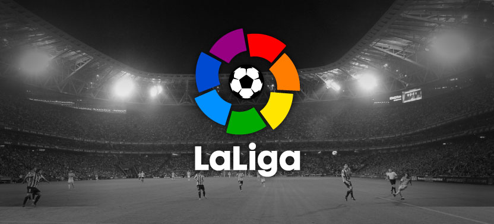
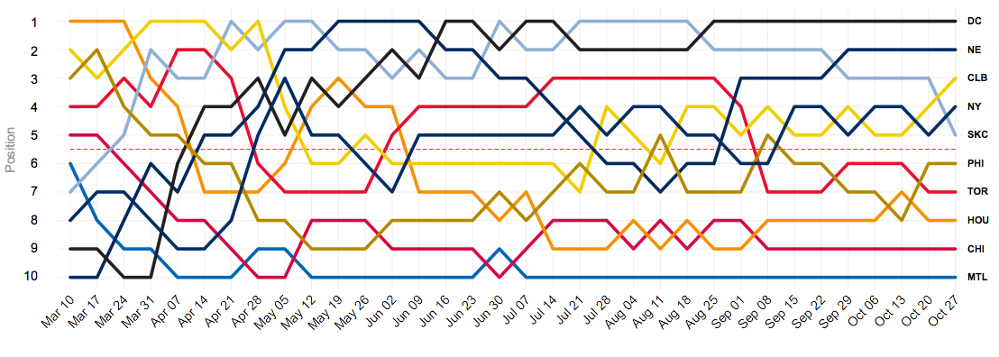
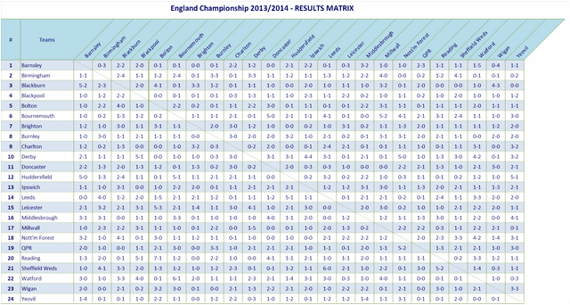

<div align="center">

</div>

<h1 dir="RTL"> 
تمرین سری سوم: از لالیگا تا لیگ برتر
</h1>

> <p dir="RTL"> 
با استفاده از داده های لیگ دسته اول اسپانیا به سوالات زیر پاسخ دهید.
از هر دو ابزار
ggplot2
و
highcharter
برای این کار تصویرسازی استفاده نمایید.
</p>

***
<p dir ="RTL">
پیش از شروع به حل تمرین تلاش می کنیم تا داده را کمی مناسب تر کنیم تا به صورتی قابل استفاده تر در بیاید.
در اینجا داده ای می سازیم که شبیه به چارت هر لیگ است.
همچنین این نکته را هم که امتیازات برد ها پیش از سال ۹۵، ۲ امتیاز بوده به جای ۳ امتیاز را محاسبه می کنیم ولی در بعضی جاها از همان ۳ امتیازه استفاده می کنیم و در بعضی جاها از ۲ امتیازه(در سوال اول بخش اول از ۲ امتیازه استفاده شده است).
</p>
```{r preprocess, echo=TRUE, message=FALSE, warning=FALSE, paged.print=FALSE}
library(engsoccerdata)
library(dplyr)
library(ggplot2)
library(highcharter)
library(kableExtra)
library(knitr)
library(tidyr)

la <- spain %>% 
  filter(tier == 1,
         round == "league")
lah <- la %>%
  mutate(
    team = home,
    opp = visitor,
    GF = hgoal,
    GA = vgoal,
    GD = hgoal - vgoal,
    win = hgoal > vgoal,
    lose = hgoal < vgoal,
    draw = hgoal == vgoal
  ) %>%
  mutate(score = (Season >= 1995) * win * 3 + (Season <= 1994)*win * 2 +  draw) %>%
  mutate(score3 = win * 3 + draw) %>% 
  select(-home, -visitor, -hgoal, -vgoal, -HT, -FT)


lav <- la %>%
  mutate(
    team = visitor,
    opp = home,
    GF = vgoal,
    GA = hgoal,
    GD = vgoal - hgoal,
    win = hgoal < vgoal,
    lose = hgoal > vgoal,
    draw = hgoal == vgoal
  ) %>%
  mutate(score = (Season >= 1995) * win * 3 + (Season <= 1994) *win* 2 +  draw) %>%
  mutate(score3 = win * 3 + draw) %>% 
  select(-home, -visitor, -hgoal, -vgoal, -HT, -FT)

laAll <- rbind(lav, lah)

laCA <- laAll %>%
  group_by(team, Season, tier, round, group) %>%
  summarize(
    GF = sum(GF),
    GA = sum(GA),
    GD = sum(GD),
    win = sum(win),
    lose = sum(lose),
    draw = sum(draw),
    score = sum(score),
    score3 = sum(score3),
    games = n()
  ) %>% ungroup()

```

```{r Theme, message=FALSE, warning=FALSE, include=FALSE, paged.print=FALSE}
theme_Publication <-
  function(base_size = 14,
           base_family = "Helvetica") {
    library(grid)
    library(ggthemes)
    (
      theme_foundation(base_size = base_size, base_family = base_family)
      + theme(
        plot.title = element_text(
          face = "bold",
          size = rel(1.2),
          hjust = 0.5
        ),
        text = element_text(),
        panel.background = element_rect(colour = NA),
        plot.background = element_rect(colour = NA),
        panel.border = element_rect(colour = NA),
        axis.title = element_text(face = "bold", size = rel(1)),
        axis.title.y = element_text(angle = 90, vjust = 2),
        axis.title.x = element_text(vjust = -0.2),
        axis.text = element_text(),
        axis.line = element_line(colour = "black"),
        axis.ticks = element_line(),
        panel.grid.major = element_line(colour = "#f0f0f0"),
        panel.grid.minor = element_blank(),
        legend.key = element_rect(colour = NA),
        legend.position = "bottom",
        legend.direction = "horizontal",
        legend.key.size = unit(0.2, "cm"),
        legend.margin = unit(0, "cm"),
        legend.title = element_text(face = "italic"),
        plot.margin = unit(c(10, 5, 5, 5), "mm"),
        strip.background = element_rect(colour = "#f0f0f0", fill =
                                          "#f0f0f0"),
        strip.text = element_text(face = "bold")
      )
    )
    
  }

scale_fill_Publication <- function(...) {
  library(scales)
  discrete_scale("fill", "Publication", manual_pal(
    values = c(
      "#386cb0",
      "#fdb462",
      "#7fc97f",
      "#ef3b2c",
      "#662506",
      "#a6cee3",
      "#fb9a99",
      "#984ea3",
      "#ffff33"
    )
  ), ...)
  
}

scale_colour_Publication <- function(...) {
  library(scales)
  discrete_scale("colour", "Publication", manual_pal(
    values = c(
      "#386cb0",
      "#fdb462",
      "#7fc97f",
      "#ef3b2c",
      "#662506",
      "#a6cee3",
      "#fb9a99",
      "#984ea3",
      "#ffff33",
      "#e73157",
      "#049bd9",
      "#c70394",
      "#30da63",
      "#a71916",
      "#7c092c",
      "#d07ef6",
      "#6f27a5",
      "#de0bfb",
      "#c0e03f",
      "#bb74fc"
    )
  ), ...)
}
theme_set(theme_Publication())
scale_colour_discrete <- scale_colour_Publication
scale_fill_discrete <- scale_fill_Publication

```


***

<p dir="RTL">
۱. تعداد قهرمانی های تیم ها در تاریخ لالیگا  را استخراج کرده و نمودار ستونی آنها را رسم کنید.
</p>
<p dir = "RTL">
برای این سوال لازم است چند قانون را رعایت کنیم.
اولین قانون این است که پیش از ۱۹۹۵ امتیازات به این صورت محاسبه می شدند که هر برد ۲ امتیاز داشت که این مورد در قسمت قبلی رعایت شده است.
مورد دیگر این است که پس از ۱۹۳۵ برای تعیین قهرمان ابتدا امتیاز، سپس تفاضل گل بازی رو در رو و سپس تفاضل گل کل را مقایسه می  کنند.
پیش از آن ابتدا امتیاز و سپس تفاضل گل را مقایسه می کردند.
حال ابتدا سال هایی را که در آن ها ۲ تیم امتیاز مساوی داشتند را به دست می آوریدم، سپس از میان آن ها آنی را که قهرمان می شود محاسبه می کنیم و در نهایت همه ی قهرمانی ها را بدست می آوریم.
</p>
```{r 1_A, echo=TRUE, fig.height=9, fig.width=16, message=FALSE, warning=FALSE, paged.print=FALSE}
laCA %>%
  group_by(Season) %>%
  top_n(n = 1, wt = score) %>%
  ungroup() -> all_cands

all_cands %>%
  group_by(Season) %>%
  filter(n() < 2) %>% ungroup() -> non_dups
all_cands %>%
  group_by(Season) %>%
  filter(n() >= 2) %>% ungroup() -> dups
rbind(dups %>% filter(Season <= 1935) %>% top_n(n = 1, wt = GD), non_dups)  -> non_dups
dups <- dups %>% filter(Season > 1935)
kable(dups %>%
        arrange(-Season) %>% select(team, Season,score))

dups_winners <- NULL
for (s in unique(dups$Season)) {
  cands <- dups %>% filter(Season == s)
  x <- as.character(cands[1, 'team'])
  y <- as.character(cands[2, 'team'])
  game1 <- la %>% filter(home ==  x, visitor == y, Season == s)
  game2 <- la %>% filter(home ==  y, visitor == x, Season == s)
  
  gd = game1$hgoal - game1$vgoal - game2$hgoal + game2$vgoal
  if (gd > 0) {
    dups_winners <- rbind(dups_winners, cands[1,])
  } else if (gd < 0) {
    dups_winners <- rbind(dups_winners, cands[2,])
  } else if (gd == 0) {
    if (as.numeric(cands[1, 'GD']) > as.numeric(cands[2, 'GD'])) {
      dups_winners <- rbind(dups_winners, cands[1,])
    } else{
      dups_winners <- rbind(dups_winners, cands[2,])
    }
  }
}
champions <- rbind(dups_winners, non_dups)
champions %>% select(team, Season) -> champions
champions %>% group_by(team) %>% summarize(championships = n()) %>%
  arrange(-championships) %>%
  hchart(type = "bar",
         hcaes(x = team, y = championships, color = team),
         name = "No. of Championships") %>%
  hc_title(text = "All Championships") %>% 
  hc_xAxis(title = list(text = "Teams")) %>%
  hc_yAxis(title = list(text = "No. of Championsips"))  %>%
  hc_add_theme(hc_theme_sandsignika())

ggplot(
  champions %>% group_by(team) %>% summarize(championships = n()) %>%
    arrange(-championships),
  aes(
    x = reorder(team, championships),
    y = championships,
    fill = team
  )
) +
  geom_bar(stat = "identity") +
  guides(fill = F) +
  xlab("Teams") +
  ylab("No. of Championsips") +
  ggtitle("All Championships") + coord_flip()

```


<p dir = "RTL">
همانطور که در گروه درس گفته شده می توانستیم فرض کنیم در تمامی سال ها بردها ۳ امتیاز داشته اند و برای رتبه بندی برحسب امتیاز، تفاضل گل و گل زده عمل می کنیم در این صورت قهرمانی ها به این صورت خواهند بود:
(در ادامه هم از این نوع امتیازدهی و رده بندی برای سایر سوال ها استفاده می کنیم)
</p>

```{r 1_B, echo=TRUE, fig.height=9, fig.width=16, message=FALSE, warning=FALSE, paged.print=FALSE}
champions <- laCA %>%
  group_by(Season) %>% 
  top_n(n = 1, wt = score3) %>% 
  top_n(n = 1, wt = GD) %>% 
  top_n(n = 1, wt = GF) %>% 
  ungroup()
champions %>% select(team, Season) -> champions
champions %>% group_by(team) %>% summarize(championships = n()) %>%
  arrange(-championships) %>%
  hchart(type = "bar",
         hcaes(x = team, y = championships, color = team),
         name = "No. of Championships") %>%
  hc_title(text = "All Championships") %>% 
  hc_xAxis(title = list(text = "Teams")) %>%
  hc_yAxis(title = list(text = "No. of Championsips"))  %>%
  hc_add_theme(hc_theme_sandsignika())

ggplot(
  champions %>% group_by(team) %>% summarize(championships = n()) %>%
    arrange(-championships),
  aes(
    x = reorder(team, championships),
    y = championships,
    fill = team
  )
) +
  geom_bar(stat = "identity") +
  guides(fill = F) +
  xlab("Teams") +
  ylab("No. of Championsips") +
  ggtitle("All Championships") + coord_flip()


```

***

<p dir="RTL">
۲. کسل کننده ترین لیگ و تیم را بیابید.
نمودار ده تیم و ده فصل کسل کننده را رسم کنید.
</p>

<p dir = "RTL">
کسل کننده ترین تیم را تیمی می گیریم که میانگین تعداد گل های زده ی ۲ طرف در بازی های آن تیم کمینه باشد.
کسل کننده ترین لیگ را هم به طور مشابه.
</p>

```{r 2, echo=TRUE, fig.height=9, fig.width=16, message=FALSE, warning=FALSE, paged.print=FALSE}
laCA %>%
  group_by(team) %>%
  summarize(not_boringness = (sum(GF) + sum(GA)) / sum(games)) %>%
  arrange(not_boringness) -> mostBoringTeams

kable(mostBoringTeams %>% head(1))

laCA %>%
  group_by(Season) %>%
  summarize(not_boringness = (sum(GF) + sum(GA)) / sum(games)) %>%
  arrange(not_boringness)  -> mostBoringSeasons

kable(mostBoringSeasons %>% head(1))

ggplot(
  mostBoringTeams %>% head(10),
  aes(
    x = reorder(team, -not_boringness),
    y = not_boringness,
    fill = not_boringness
  )
) +
  geom_bar(stat = "identity") +
  guides(fill = F) +
  xlab("Team") +
  ylab("Avg. goals in each game") +
  ggtitle("Top 10 Boring Teams") + coord_flip()

mostBoringTeams %>% head(10) %>% arrange(not_boringness) %>% 
mutate(not_boringness = round(not_boringness, digits = 2)) %>%
hchart(type = "bar",
       hcaes(x = team, y = not_boringness, color = not_boringness),
       name = "Avg. goals in each game") %>%
  hc_title(text = "Top 10 Boring Teams") %>% 
  hc_xAxis(title = list(text = "Teams")) %>%
  hc_yAxis(title = list(text = "Avg. goals in each game"))  %>%
  hc_add_theme(hc_theme_sandsignika())

ggplot(
  mostBoringSeasons %>% head(10),
  aes(
    x = reorder(Season, -not_boringness),
    y = not_boringness,
    fill = not_boringness
  )
) +
  geom_bar(stat = "identity") +
  guides(fill = F) +
  xlab("Season") +
  ylab("Avg. goals in each game") +
  ggtitle("Top 10 Boring Seasons") + coord_flip()

mostBoringSeasons %>% head(10) %>% arrange(not_boringness) %>% 
  mutate(not_boringness = round(not_boringness, digits = 2)) %>% 
  hchart(type = "bar",
         hcaes(x = as.factor(Season), y = not_boringness, color = not_boringness),
         name = "Avg. goals in each game") %>%
  hc_title(text = "Top 10 Boring Seasons") %>% 
  hc_xAxis(title = list(text = "Season")) %>%
  hc_yAxis(title = list(text = "Avg. goals in each game"))  %>%
  hc_add_theme(hc_theme_sandsignika())

```

***

<p dir="RTL">
۳. در چند درصد موارد قهرمان نیم فصل در پایان فصل قهرمان شده است؟
</p>

<p dir = "RTL">
ابتدا بازی های نیم فصل اول را جدا می کنیم و مشابه سوال ۱ قهرمان را از میان آن ها به دست می آوریم.
سپس قهرمان های نیم فصل را به همراه قهرمان های کل فصل در یک جدول می آوریم و نتیجه را بررسی می کنیم.
</p>

```{r 3, echo=TRUE, fig.height=5, fig.width=16, message=FALSE, warning=FALSE, paged.print=FALSE}

laAll %>%
  group_by(Season, team, opp) %>%
  arrange(Date) %>% 
  top_n(n = 1, wt = desc(Date)) -> firstHalfSeasonsAll

laCAHalf <- firstHalfSeasonsAll %>%
  group_by(team, Season, tier, round, group) %>%
  summarize(
    GF = sum(GF),
    GA = sum(GA),
    GD = sum(GD),
    win = sum(win),
    lose = sum(lose),
    draw = sum(draw),
    score = sum(score),
    score3 = sum(score3),
    games = n()
  ) %>% ungroup()


halfChampions <- laCAHalf %>%
  group_by(Season) %>%
  top_n(n = 1, wt = score3) %>%
  top_n(n = 1, wt = GD) %>%
  top_n(n = 1, wt = GF) %>%
  ungroup()
halfChampions %>% select(halfChamp = team, Season) -> halfChampions

halfAndFinalChamp <-
  full_join(x = halfChampions,
            y = champions %>%
              select(Champ = team, Season),
            by = 'Season')%>% 
  mutate(isTheSame = (halfChamp == Champ))

ggplot(halfAndFinalChamp, aes(x = Season, y = ""))+
  geom_point(aes(color = isTheSame), stat = "identity", size = 5) +
  xlab("Season") +
  ylab("The Same?")+
  ggtitle("Half-Season Champ = Season Champ")
```

```{r 3_B, echo=TRUE, fig.height=12, fig.width=16, message=FALSE, warning=FALSE, paged.print=FALSE}
halfAndFinalChamp %>%
  group_by(isTheSame) %>%
  summarize(count = n()) %>%
  ungroup() -> shareChamp

ggpie <- function (dat, by, totals) {
  ggplot(dat, aes_string(x = factor(1), y = totals, fill = by)) +
    geom_bar(stat = 'identity', color = 'black') +
    xlab("") +
    ylab("") +
    theme(
      axis.line = element_blank(),
      axis.ticks.y = element_blank(),
      axis.text.y = element_blank()
    ) + # removes black borders from legend
    coord_polar(theta = 'y') +
    scale_y_continuous(breaks = cumsum(dat[[totals]]) - dat[[totals]] /
                         2, labels = dat[[by]])
}


ggpie(dat = shareChamp, by = "isTheSame", totals = "count") +
  ggtitle("Half-Season Champ = Season Champ")

halfAndFinalChamp %>%
  hchart(type = "point", hcaes(
    x = Season,
    y = 1 * isTheSame,
    color = isTheSame
  )) %>%
  hc_title(text = "Half-Season Champ = Season Champ") %>%
  hc_xAxis(title = list(text = "Season")) %>%
  hc_yAxis(title = list(text = "The Same?"))  %>%
  hc_add_theme(hc_theme_sandsignika())

shareChamp %>%
  hchart(type = "pie",
         hcaes(
           x = isTheSame,
           y = count,
           name = as.factor(isTheSame)
         ),
         name = "count") %>%
  hc_title(text = "Half-Season Champ = Season Champ") %>%
  hc_add_theme(hc_theme_sandsignika())


kable(sprintf("%0.2f%%", mean(halfAndFinalChamp$isTheSame) * 100))


```


***

<p dir="RTL">
۴. در بین سال های ۲۰۰۱ تا ۲۰۱۰ گربه سیاه تیم های بزرگ چه تیم هایی بوده است؟
</p>

<p dir = "RTL">
برای محاسبه ی گربه سیاه ها ابتدا باید بهترین تیم ها را پیدا کنیم که این کار را محاسبه ی جمع امتیازات تیم ها برداشتن ۶ تیم اول آن ها انجام می دهیم.
سپس برای این تیم ها یک تیم از میان تیم های دیگر را که نسبت باخت این تیم ها  به آن تیم بیشینه بوده پیدا می کنیم و آن را به عنوان گربه سیاه آن تیم معرفی می کنیم.
</p>

```{r 4, echo=TRUE, message=FALSE, warning=FALSE, paged.print=FALSE}
laCA_1_10 <- laCA %>% filter(Season <= 2010, Season >= 2001)
laAll_1_10 <- laAll %>% filter(Season <= 2010, Season >= 2001)

laCA %>%
  group_by(team) %>%
  summarize(scoresum = sum(score3)) %>%
  top_n(n = 6, wt = scoresum) %>% 
  arrange(-scoresum) -> greatest_teams

greatest_teams_games <- laAll_1_10 %>% 
  filter(team %in% greatest_teams$team)

laCA_1_10 <- laCA %>% filter(Season <= 2010, Season >= 2001)
laAll_1_10 <- laAll %>% filter(Season <= 2010, Season >= 2001)

laAll %>%
  group_by(team) %>%
  summarize(scoresum = mean(score3)) %>%
  top_n(n = 7, wt = scoresum) %>% 
  arrange(-scoresum) -> greatest_teams

greatest_teams_games <- laAll_1_10 %>% 
  filter(team %in% greatest_teams$team)

greatest_teams_games %>% 
  filter(!(opp %in% greatest_teams$team)) %>% 
  group_by(team, opp) %>%
  summarize(loseRate = mean(lose), GD = sum(GD)) %>% 
  ungroup() %>% 
  group_by(team) %>% 
  top_n(n = 1, wt = loseRate) %>%
  top_n(n = 1, wt = -GD) %>% 
  top_n(n = 1, wt=  opp) %>% 
  ungroup() -> black_cats

kable(black_cats)

```


***

<p dir="RTL">
۵. در تاریخ لالیگا کدام تیم رکورددار زودترین قهرمانی است؟
همچنین کدام تیم مقتدرانه ترین قهرمانی را داشته است؟
</p>

```{r 5_A, echo=TRUE, fig.height=9, fig.width=16, message=FALSE, warning=FALSE, paged.print=FALSE}
laAll %>%
  group_by(Season, team) %>%
  arrange(Date) %>%
  mutate(
    current_score = cumsum(score3),
    current_GD = cumsum(GD),
    current_GF = cumsum(GF),
    week = row_number(),
    number_of_all_games = n()
  ) %>%
  mutate(left_games = number_of_all_games - week) %>%
  select(
    Season,
    week,
    team,
    current_score,
    current_GD,
    current_GF,
    Date,
    number_of_all_games,
    left_games
  ) %>% ungroup()-> week_chart

week_chart %>%
  group_by(Season, week) %>%
  arrange(-current_score, -current_GD, -current_GF) %>%
  mutate(current_rank = row_number()) %>% ungroup ()-> week_chart_rank


champions_week_left <- week_chart_rank %>%
  group_by(Season, week) %>% 
  mutate(
    bot_diff = current_score - lead(current_score, 1)
  ) %>%
  filter(current_rank == 1, bot_diff > 3 * left_games) %>%
  group_by(Season) %>%
  top_n(n = 1, wt = left_games) %>%
  select(Season, Cahmpion = team, Weeks_Early = left_games)%>% 
  ungroup() %>% 
  arrange(-Weeks_Early)

kable(champions_week_left %>%
        top_n(n = 1, wt = Weeks_Early) %>% arrange(Season))

```

<p dir="RTL">
معیارمان برای مقتدرانه بودن نسبت امتیاز تیم قهرمان به تیم دوم جدول در انتهای فصل است.
حال ۱۰ قهرمانی مقتدرانه تاریخ را پیدا می کنیم.
</p>
```{r 5_B, echo=TRUE, fig.height=9, fig.width=16, message=FALSE, warning=FALSE, paged.print=FALSE}
greatest_championships <-week_chart_rank %>% 
  filter(left_games == 0, current_rank %in% c(1,2)) %>% 
  group_by(Season) %>% 
  arrange(current_rank) %>% 
  mutate(bot_diff_ratio = current_score / lead(current_score, 1)) %>% 
  ungroup() %>% 
  filter(current_rank ==1) %>% 
  select(Season, Champion = team, bot_diff_ratio) %>% 
  arrange(-bot_diff_ratio) %>% head(10) %>%
  mutate(bot_diff_ratio = round(bot_diff_ratio, digits = 2))

greatest_championships %>% 
  hchart(type = "bar",
         hcaes(x = paste(Champion, "(", Season, ")"), y = bot_diff_ratio, color = Champion,
               name = Season), name = "Score ratio to runner up") %>%
  hc_title(text = "Greatest Championships") %>% 
  hc_xAxis(title = list(text = "Team/Season")) %>%
  hc_yAxis(title = list(text = "Score ratio to runner up"), min = 1)  %>%
  hc_add_theme(hc_theme_sandsignika())

ggplot(
  greatest_championships,
  aes(
    x = reorder(paste(Champion, "(", Season, ")"), bot_diff_ratio),
    y = bot_diff_ratio,
    fill = Champion
  )
) +
  geom_bar(stat = "identity") +
  guides(fill = F) +
  xlab("Team/Season") +
  ylab("Score ratio to runner up") +
  ggtitle("Greatest Championships") + coord_flip()

```

***

<p dir="RTL">
۶. طولانی ترین نوار پیروزی مساوی و شکست مال چه تیم هایی است؟
</p>

```{r 6, echo=TRUE, fig.height=9, fig.width=16, message=FALSE, warning=FALSE, paged.print=FALSE}
# We determine consecutive results by score gained in the game
laAll %>%
  group_by(team) %>%
  arrange(Date)%>%
  summarize(
    cons_wins = max(rle(win)[["lengths"]][rle(win)[["values"]]]),
    cons_draws = max(rle(draw)[["lengths"]][rle(draw)[["values"]]]),
    cons_lose = max(rle(lose)[["lengths"]][rle(lose)[["values"]]])
  ) -> cons_all

cons_all %>% arrange(-cons_wins) %>% top_n(n = 5, cons_wins) %>%
  select(-cons_draws, -cons_lose)-> most_wins
cons_all %>% arrange(-cons_draws) %>% top_n(n = 5, cons_draws) %>%
  select(-cons_wins, -cons_lose)-> most_draws
cons_all %>% arrange(-cons_lose) %>% top_n(n = 5, cons_lose) %>%
  select(-cons_draws, -cons_wins)-> most_lose

most_wins %>% 
  hchart(type = "bar",
         hcaes(x = team, y = cons_wins),
         name = "Longest Consecutive Wins") %>%
  hc_title(text = "Longest Consecutive Wins") %>% 
  hc_xAxis(title = list(text = "Team")) %>%
  hc_yAxis(title = list(text = "Longest Consecutive Win"), min = 5)  %>%
  hc_add_theme(hc_theme_sandsignika())

ggplot(
  most_wins,
  aes(
    x = reorder(team, cons_wins),
    y = cons_wins,
    fill = ""
  )
) +
  geom_bar(stat = "identity") +
  guides(fill = F) +
  xlab("Team") +
  ylab("Longest Consecutive Win") +
  ggtitle("Longest Consecutive Wins") + coord_flip()


most_draws %>% 
  hchart(type = "bar",
         hcaes(x = team, y = cons_draws),
         name = "Longest Consecutive Draws") %>%
  hc_title(text = "Longest Consecutive Draws") %>% 
  hc_xAxis(title = list(text = "Team")) %>%
  hc_yAxis(title = list(text = "Longest Consecutive Draws"), min = 5)  %>%
  hc_add_theme(hc_theme_sandsignika())

ggplot(
  most_draws,
  aes(
    x = reorder(team, cons_draws),
    y = cons_draws,
    fill =""
  )
) +
  geom_bar(stat = "identity") +
  guides(fill = F) +
  xlab("Team") +
  ylab("Longest Consecutive Draws") +
  ggtitle("Longest Consecutive Draws") + coord_flip()


most_lose %>% 
  hchart(type = "bar",
         hcaes(x = team, y = cons_lose),
         name = "Longest Consecutive Losses") %>%
  hc_title(text = "Longest Consecutive Losses") %>% 
  hc_xAxis(title = list(text = "Team")) %>%
  hc_yAxis(title = list(text = "Longest Consecutive Losses"), min =5)  %>%
  hc_add_theme(hc_theme_sandsignika())

ggplot(
  most_lose,
  aes(
    x = reorder(team, cons_lose),
    y = cons_lose,
    fill =""
  )
) +
  geom_bar(stat = "identity") +
  guides(fill = F) +
  xlab("Team") +
  ylab("Longest Consecutive Losses") +
  ggtitle("Longest Consecutive Losses") + coord_flip()

```


***

<p dir="RTL">
۷. زودترین سقوط مال کدام تیم بوده است؟
</p>

<p dir = "RTL">
از داده ی محاسبه شده برای هر هفته استفاده می کنیم و زودترین هفته ای را به دست می آوریم که در آن اختلاف تیم های آخر و ۴م از آخر بیشتر از ۳ برابر تمام بازی های باقیمانده بشود.
</p>


```{r 7, echo=TRUE, fig.height=9, fig.width=16, message=FALSE, warning=FALSE, paged.print=FALSE}
#We assume that 3 teams relegate
week_chart %>%
  group_by(Season, week) %>%
  arrange(-current_score, -current_GD, -current_GF) %>%
  mutate(current_rank = row_number()) %>%
  mutate(top_3_diff = lag(current_score, 3) - current_score) %>% 
  filter(current_rank == (number_of_all_games / 2) + 1,
         top_3_diff > 3 * left_games) %>%
  group_by(Season) %>%
  top_n(n = 1, wt = left_games) %>%
  select(Season,Team =  team, Weeks_Early = left_games) %>%
  ungroup() %>%
  arrange(-Weeks_Early) -> relegations_week_left

earliest_relegations <-relegations_week_left %>%
  top_n(n = 5, wt = Weeks_Early) %>% arrange(-Weeks_Early,Season)

earliest_relegations%>% 
  hchart(type = "bar",
         hcaes(x = paste(Team, "(",Season, ")") , y = Weeks_Early),
         name = "Weeks Before Season End") %>%
  hc_title(text = "Earliest Relegations") %>% 
  hc_xAxis(title = list(text = "Team")) %>%
  hc_yAxis(title = list(text = "Weeks Before Season End"), min =2)  %>%
  hc_add_theme(hc_theme_sandsignika())


ggplot(
  earliest_relegations,
  aes(
    x = reorder(paste(Team, "(",Season, ")"), Weeks_Early),
    y = Weeks_Early,
    fill =""
  )
) +
  geom_bar(stat = "identity") +
  guides(fill = F) +
  xlab("Team") +
  ylab("Weeks Before Season End") +
  ggtitle("Earliest Relegations") + coord_flip()

```

***

<div align="center">

</div>

<p dir="RTL">
۸. مانند شکل بالا تصویری از روند تغییر رتبه تیم ها در طول فصل ۱۹۹۸ رسم نمایید.
</p>


```{r 8, echo=TRUE, fig.height=12, fig.width=16, message=FALSE, warning=FALSE, paged.print=FALSE}
week_chart_rank %>%
  filter(Season == 1998) %>%
  select(week, team, current_rank, Date) %>%
  group_by(week) %>% mutate(week_end_date = min(Date)) %>%
  ungroup() %>% arrange(week) -> chart_98

chart_98 %>%
  hchart("line", hcaes(x = week_end_date, y = current_rank, group = team)) %>%
  hc_title(text = "1998 League") %>%
  hc_xAxis(
    title = list(text = "Week"),
    tickInterval = 1,
    type = 'datetime',
    labels = list(rotation = -45, format = '{value:%b %e}')
  ) %>%
  hc_yAxis(
    title = list(text = "Rank"),
    reversed = T,
    tickInterval = 1,
    max = 20,
    min = 1
  )  %>%
  hc_tooltip(crosshairs = T) %>%
  hc_add_theme(hc_theme_sandsignika())


chart_98 %>%
  ggplot(aes(
    x = week_end_date,
    y = current_rank,
    group = team,
    color = team
  )) +
  geom_line() +
  scale_y_reverse(breaks = 1:20)+
  scale_x_date(breaks = seq.Date(
    min(chart_98$week_end_date),
    max(chart_98$week_end_date),
    "week"
  ),
  labels = date_format("%b %d")) +
  theme(axis.text.x = element_text(
    angle = 45,
    size = 10,
    hjust = 1,
    vjust = 1,
    family = "Helvetica"
    
  )) +
  xlab("Week") +
  ylab("Rank") +
  ggtitle("1998 League")

```


***

<div align="center">

</div>

<p dir="RTL">
۹. جدولی مشابه بالا برای فصل ۲۰۱۲ از  کل نتایج طراحی کنید.
</p>
<p dir = "RTL">
با استفاده از kable
</p>

```{r 9, echo=TRUE, message=FALSE, warning=FALSE, paged.print=FALSE}
la_2012 <- la %>% filter(Season == 2012) %>% select(home, visitor, FT)
la_2012 %>% tidyr::spread(visitor, FT) -> chart_12

kable(chart_12, format = "html") %>%
  kable_styling("striped", full_width = F) %>%
  scroll_box(height = "10in")

```

<p dir = "RTL">
با استفاده از geom_tile
</p>

```{r 9_B, echo=TRUE, fig.height=12, fig.width=16, message=FALSE, warning=FALSE, paged.print=FALSE}
la_2012_other <-
  la %>% filter(Season == 2012) %>% select(home, visitor, FT, hgoal)
teams_12 <- unique(la_2012 %>% select(home))
la_2012_self <- teams_12 %>%
  mutate(visitor = home,
         FT = "",
         hgoal = 0)
la_2012 <- rbind(la_2012_other, la_2012_self)

scale_fill_Matrix <- function(...) {
  library(scales)
  discrete_scale("fill", "Publication", manual_pal(values = c("white",
                                                              "lightBlue")), ...)
}

ggplot(la_2012, aes(reorder(home, -desc(home)), reorder(visitor, desc(visitor)))) +
  # x and y axes => Var1 and Var2
  geom_tile(aes(fill = as.factor((
    as.numeric(as.factor(home)) +
      as.numeric(as.factor(visitor))
  ) %% 2)), color = "black") + # background colours are mapped according to the value column
  geom_text(aes(label = FT)) + # write the values
  theme(
    panel.grid.major.x = element_blank(),
    #no gridlines
    panel.grid.minor.x = element_blank(),
    panel.grid.major.y = element_blank(),
    panel.grid.minor.y = element_blank(),
    panel.background = element_rect(fill = "white"),
    # background=white
    axis.text.x = element_text(
      angle = 40,
      hjust = 0,
      vjust = -2,
      size = 12,
      face = "bold"
    ),
    plot.title = element_text(size = 20, face = "bold"),
    axis.text.y = element_text(size = 12, face = "bold")
  ) +
  ggtitle("1998 League") +
  theme(legend.title = element_text(face = "bold", size = 14)) +
  scale_x_discrete(name = "", position = "top") +
  scale_y_discrete(name = "") +
  labs(fill = "") +
  geom_abline(slope = -1, intercept = 21) +
  guides(fill = F) + scale_fill_Matrix()

```

***

<p dir="RTL">
۱۰. سه آماره به همراه نمودار فردوسی پسند استخراج کنید.
</p>

<p dir = "RTL">
در این نمودار نمودار میانگین تعداد گل های هفته های مختلف لیگ را از ۱۹۹۷ به بعد می کشیم.
به طور شهودی احتمالن باید این نمودار نمودار یونیفورمی باشد.
ولی چیزی که مشاهده می کنیم این است که  تعداد گل ها به طور کلی روندی صعودی دارد و یونیفورم هم نیست.
</p>

```{r 10_A, echo=TRUE, fig.height=9, fig.width=16, message=FALSE, warning=FALSE, paged.print=FALSE}
laAll %>%
  group_by(Season, team) %>%
  arrange(Date) %>%
  mutate(week = row_number()) %>%
  ungroup() %>%
  group_by(Season , week, team) %>%
  mutate(goals = sum(GA) + sum(GF)) %>%
  ungroup() %>%
  filter(Season > 1996) %>%
  group_by(week) %>%
  summarize(avg_goals = round(mean(goals), 3)) %>%
  arrange(week) %>% 
  mutate(type = "original")-> weeks_avg_goals

coeff = coef(lm(avg_goals ~ week, data = weeks_avg_goals))
regression_line = round(coeff[2]*weeks_avg_goals$week +  coeff[1],3)
regress <- data.frame(avg_goals = regression_line, week =  weeks_avg_goals$week, type = "lm")


rbind(weeks_avg_goals, regress) %>%
  hchart(type = "line", hcaes(x = week, y = avg_goals, group = type, name = type),
         name = "Avg. Goals") %>%
  hc_title(text = "1997 - 2016 Weeks Avg. Goals") %>%
  hc_xAxis(title = list(text = "Week")) %>%
  hc_yAxis(title = list(text = "Avg. Goals"))  %>%
  hc_tooltip(crosshairs = T, shared = T) %>%
  hc_add_theme(hc_theme_sandsignika())

ggplot(weeks_avg_goals, aes(x = week, y = avg_goals, color = "")) +
  geom_line() +
  geom_smooth(method = "lm") +
  ylab("Avg. Goals") +
  xlab("Week") +
  ggtitle("1997 - 2016 Weeks Avg. Goals") +
  guides(color = F)

```


***

<p dir = "RTL">
در این نمودار عملکرد کلی تیم ها را در بازی خانکی و در بازی های بیرون از خانه مقایسه می کنیم.
و این مسئله را بررسی می کنیم که چه تاثیری دارد و اینکه آیا مهمان یا میزبان بودن با فرض بردن بازی تغییری در
توزیع نتایج ایجاد می کند یا نه.
</p>

```{r 10_B, echo=TRUE, fig.height=9, fig.width=16, message=FALSE, warning=FALSE, paged.print=FALSE}
la %>%
  filter(hgoal != vgoal, hgoal <= 5, vgoal <= 5) %>%
  mutate(HA = paste(hgoal, "-", vgoal),
         AH = paste(vgoal, "-", hgoal)) %>% select(HA, AH, hgoal, vgoal) -> HA_AH

HA_AH %>%
  filter(hgoal > vgoal) %>%
  select(AH) %>%
  group_by(AH) %>%
  summarise(count = n(), type = "A-H") %>%
  mutate(density = round(count / sum(count), 3)) %>%
  select(result = AH, count, density, type) -> AH

HA_AH %>%
  filter(hgoal < vgoal) %>%
  select(HA) %>%
  group_by(HA) %>%
  summarise(count = n(), type = "H-A") %>%
  mutate(density = round(count / sum(count), 3)) %>%
  select(result = HA, count, density, type) -> HA

rbind(HA, AH) -> AH_HA_count

AH_HA_count %>%
  hchart(type = "line", hcaes(x = result, y = count, group = type)) %>%
  hc_title(text = "Home-Away & Away-Home Results Comparison (Count)") %>%
  hc_xAxis(title = list(text = "Count"))  %>%
  hc_xAxis(title = list(text = "Result"))  %>%
  hc_tooltip(crosshairs = T, shared = T) %>%
  hc_add_theme(hc_theme_sandsignika())

AH_HA_count %>%
  hchart(type = "line", hcaes(x = result, y = density, group = type)) %>%
  hc_title(text = "Home-Away & Away-Home Results Comparison (Density)") %>%
  hc_xAxis(title = list(text = "Density"))  %>%
  hc_xAxis(title = list(text = "Result"))  %>%
  hc_tooltip(crosshairs = T, shared = T) %>%
  hc_add_theme(hc_theme_sandsignika())

ggplot(AH_HA_count,
       aes(
         x = result,
         y = count,
         group = type,
         fill = type
       )) +
  geom_area( position = "dodge", alpha = 0.5)+
  xlab("Result")+
  ylab("Count")+
  ggtitle("Home-Away & Away-Home Results Comparison (Count)")

ggplot(AH_HA_count,
       aes(
         x = result,
         y = density,
         group = type,
         fill = type
       )) +
  geom_area(position = "dodge", alpha = 0.5)+
  xlab("Result")+
  ylab("Density")+
  ggtitle("Home-Away & Away-Home Results Comparison (Density)")

  
```

<p dir = "RTL">
همانطور که مشاهده می کنید در اکثر اوقات و اکثر نتایج برنده تیم میزبان است ولی اگر چگالی را برای حالت برنده بودن را مقایسه کنیم تفاوت مشهودی وجود ندارد.
یعنی به طور کلی میزبان بودن شانس برد را بیشتر می کند ولی روی توزیع شرطی تاثیر مشهودی ندارد.
الگوی دیگری که مشاهده می کنیم این است که با زیاد شدن تفاضل گل در بازی برده شده احتمال اینکه در خانه باشیم با شیب نسبتن خطی ای افزایش می یابد.
</p>

***

<p dir = "RTL">
در این مسئله مقتدرانه ترین کامبک های تاریخ لالیگا را بررسی می کنیم.
به این معنا که بازی هایی را به دست  می آوریم که در آن ها یک تیم در نیمه ی اول بازی بازنده بوده است ولی سپس در نیمه ی دوم با بیشترین تفاضل گل ممکن بازی را می برد.
</p>

```{r 10_C, echo=TRUE, fig.height=9, fig.width=16, message=FALSE, warning=FALSE, paged.print=FALSE}
la %>%
  separate(HT, sep = "-", into = c("hgoal_h", "vgoal_h")) -> la_h

la_h$hgoal_h <- as.numeric(la_h$hgoal_h)
la_h$vgoal_h <- as.numeric(la_h$vgoal_h)

lah_h <- la_h %>%
  mutate(
    team = home,
    opp = visitor,
    GF = hgoal,
    GA = vgoal,
    GD = hgoal - vgoal,
    GF_h = hgoal_h,
    GA_h = vgoal_h,
    GD_h = hgoal_h - vgoal_h,
    win = hgoal > vgoal,
    lose = hgoal < vgoal,
    draw = hgoal == vgoal
  ) %>%
  mutate(score = (Season >= 1995) * win * 3 + (Season <= 1994) * win * 2 +  draw) %>%
  mutate(score3 = win * 3 + draw) %>%
  select(-home, -visitor, -hgoal, -vgoal, -FT, -hgoal_h, -vgoal_h)


lav_h <- la_h %>%
  mutate(
    team = visitor,
    opp = home,
    GF = vgoal,
    GA = hgoal,
    GD = vgoal - hgoal,
    GF_h = vgoal_h,
    GA_h = hgoal_h,
    GD_h = vgoal_h - hgoal_h,
    win = hgoal < vgoal,
    lose = hgoal > vgoal,
    draw = hgoal == vgoal
  ) %>%
  mutate(score = (Season >= 1995) * win * 3 + (Season <= 1994) * win * 2 +  draw) %>%
  mutate(score3 = win * 3 + draw) %>%
  select(-home, -visitor, -hgoal, -vgoal, -FT, -hgoal_h, -vgoal_h)

laAll_h <- rbind(lav_h, lah_h) %>%
  mutate(comeback = GD - GD_h)

laAll_h %>%
  filter(GD_h < 0, GD > 0) %>%
  arrange(-comeback) %>%
  select(-score,
         -score3,
         -win,
         -draw,
         -lose,
         -round,
         -notes,
         -tier,
         -group,
         -Date) %>%
  head(11) -> greatest_comebacks

greatest_comebacks %>%
  hchart(type = "bar",
         hcaes(
           x = paste(team, "-", opp, "(", Season, ",", GF_h, "-", GA_h, ",", GF, "-", GA, ")") ,
           y = comeback,
           color = team
         ),
         name = "GD in second half") %>%
  hc_title(text = "Greatest Comebacks Ever") %>%
  hc_xAxis(title = list(text = "Team")) %>%
  hc_yAxis(title = list(text = "GD in second half"),
           min = 2)  %>%
  hc_add_theme(hc_theme_sandsignika())


ggplot(greatest_comebacks,
       aes(
         x = reorder(paste(team, "-", opp, "(", Season, ",", GF_h, "-", GA_h, ",", GF, "-", GA, ")"), comeback),
         y = comeback,
         fill = team
       )) +
  geom_bar(stat = "identity") +
  guides(fill = F) +
  xlab("Team") +
  ylab("GD in second half") +
  ggtitle("Greatest Comebacks Ever") + coord_flip()

```


