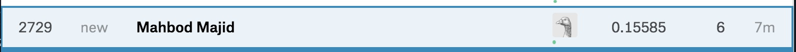

<div align="center">

</div>

> <p dir="RTL"> 
با توجه به داده های قیمت منازل
لطفا با سوالات زیر پاسخ دهید.
</p>

```{r preprocess, message=FALSE, warning=FALSE, code=readLines("./../Solutions/0.R"), include=FALSE, paged.print=FALSE}
```

```{r theme, message=FALSE, warning=FALSE, include=FALSE, paged.print=FALSE}
theme_Publication <-
  function(base_size = 14,
           base_family = "Helvetica") {
    library(grid)
    library(ggthemes)
    (
      theme_foundation(base_size = base_size, base_family = base_family)
      + theme(
        plot.title = element_text(
          face = "bold",
          size = rel(1.2),
          hjust = 0.5
        ),
        text = element_text(),
        panel.background = element_rect(colour = NA),
        plot.background = element_rect(colour = NA),
        panel.border = element_rect(colour = NA),
        axis.title = element_text(face = "bold", size = rel(1)),
        axis.title.y = element_text(angle = 90, vjust = 2),
        axis.title.x = element_text(vjust = -0.2),
        axis.text = element_text(),
        axis.line = element_line(colour = "black"),
        axis.ticks = element_line(),
        panel.grid.major = element_line(colour = "#f0f0f0"),
        panel.grid.minor = element_blank(),
        legend.key = element_rect(colour = NA),
        legend.position = "bottom",
        legend.direction = "horizontal",
        legend.key.size = unit(0.2, "cm"),
        legend.margin = unit(0, "cm"),
        legend.title = element_text(face = "italic"),
        plot.margin = unit(c(10, 5, 5, 5), "mm"),
        strip.background = element_rect(colour = "#f0f0f0", fill =
                                          "#f0f0f0"),
        strip.text = element_text(face = "bold")
      )
    )
    
  }

scale_fill_Publication <- function(...) {
  library(scales)
  discrete_scale("fill", "Publication", manual_pal(
    values = c(
      "#386cb0",
      "#fdb462",
      "#7fc97f",
      "#ef3b2c",
      "#662506",
      "#a6cee3",
      "#fb9a99",
      "#984ea3",
      "#ffff33"
    )
  ), ...)
  
}

scale_colour_Publication <- function(...) {
  library(scales)
  discrete_scale("colour", "Publication", manual_pal(
    values = c(
      "#386cb0",
      "#fdb462",
      "#7fc97f",
      "#ef3b2c",
      "#662506",
      "#a6cee3",
      "#fb9a99",
      "#984ea3",
      "#ffff33",
      "#e73157",
      "#049bd9",
      "#c70394",
      "#30da63",
      "#a71916",
      "#7c092c",
      "#d07ef6",
      "#6f27a5",
      "#de0bfb",
      "#c0e03f",
      "#bb74fc"
    )
  ), ...)
}
theme_set(theme_Publication())
scale_colour_discrete <- scale_colour_Publication
scale_fill_discrete <- scale_fill_Publication

```

***

<p dir="RTL">
۱. ماتریس همبستگی متغیرهای مختلف را به دست آورده و سپس رسم نمایید.
اعداد به دست آمده را با آزمون فرض معناداری همبستگی بسنجید و سپس ده متغیری که همبستگی بالاتری با قیمت دارند را مشخص نمایید.
</p>
```{r 1, fig.height=16, fig.width=16, message=FALSE, warning=FALSE, code=readLines("./../Solutions/1.R"), paged.print=FALSE}
```
***

<p dir="RTL">
۲. در یک تصویر نمودار پراکنش دو به دو ده متغیر بدست آمده به همراه قیمت را رسم نمایید و هم خطی بودن متغیرها را بررسی کنید
</p>

<p dir="RTL">
طبق نمودار ها می توان دید که برخی جفت ها با هم خطی دارند.
مثل
SalePrice-OverallQual,
SalePrice-GrLivArea,
GrLivArea-1stFlrSF,
TotalBsmtSF-1stFlrSF,
GrLivArea-TotRmsAbvGrd.
</p>

<p dir="RTL">
برای بررسی وجود هم خطی میان
متغیرها
از تست
Farrar-Glauber
و چند تست دیگر
استفاده می کنیم.
مقادیر این تست به ما نشان می دهند که برای مدل خطیمان هم خطی داریم که چیز خوبی نیست.
نتیجتن باید چند تا از ستون ها را حذف کنیم تا هم خطی را از بین ببریم.
</p>

```{r 2, fig.height=16, fig.width=16, message=FALSE, warning=FALSE, code=readLines("./../Solutions/2.R"), paged.print=FALSE}
```

***

<p dir="RTL">
۳. یک مدل خطی بر اساس ده متغیر برای پیش بینی قیمت برازش دهید. و سپس خلاصه نتایج مدل را به دست آورید.
</p>

```{r 3, fig.height=9, fig.width=16, message=FALSE, warning=FALSE, code=readLines("./../Solutions/3.R"), paged.print=FALSE}
```

***

<p dir="RTL">
۴. نمودار قیمت واقعی و قیمت پیش بینی را رسم نمایید و خوب بودن مدل را ارزیابی کنید.
</p>


<p dir="RTL">
برای اینکه مدل خوب باشد باید داده ها نزدیک خط
$x=y$
باشند.
که تا حد قابل قبولی این طور هست.
</p>


```{r 4, fig.height=9, fig.width=16, message=FALSE, warning=FALSE, code=readLines("./../Solutions/4.R"), paged.print=FALSE}
```

***

<p dir="RTL">
۵. مقدار
R-squared
 مدل را به دست آورید. آیا بر اساس این کمیت مدل به خوبی به داده ها برازش داده شده است؟
 کمیت
 F-statistic
 را در خلاصه مدل تفسیر نمایید.
</p>

<p dir="RTL">
مقدار
R-squared
مشخص می کند که مدلمان تا چه حدی تغییرات
داده را می تواند توضیح دهد.
مقدار
adjusted-R-sqaured
هم تاثیر زیاد بودن تعداد متغیرهای 
رگرسیون را کمتر می کند.
این مقدار حدودن
می شود
$0.77$
که تا حد خوبی قابل قبول است.
</p>

<p dir="RTL">
کمیت
f-statistic
اگر زیاد باشد نشانه ی وجود ارتباطی میان
predictor
های ما
و
response
است.
که در اینجا از آنجایی که مقدار
آن زیاد است و پی ولیو هم بسیار کوچک است می توان این
نتیجه را گرفت که 
ارتباطی وجود دارد.
در واقع بیشتر بودن
این مقدار اعتماد ما را به
r-squared
به دست آمده بیشتر می کند.
</p>

```{r 5, fig.height=9, fig.width=16, message=FALSE, warning=FALSE, code=readLines("./../Solutions/5.R"), paged.print=FALSE}
```


***

<p dir="RTL">
۶. بر اساس
p-value
 سطح معناداری ضرایب تصمیم بگیرید که چه متغیرهایی در مدل سازی استفاده شود.
بر اساس متغیرهای جدید دوباره مدل سازی کنید و نتایج رو گزارش دهید.
</p>


<p dir="RTL">
بر اساس پی ولیوها به این نتیجه می رسیم که دو تا از
عوامل ربط معناداری ندارند و آن ها را حذف می کنیم.
حال
اگر دوباره یک مدل خطی به داده هایمان فیت کنیم خواهیم دید که 
r-sqaured
تغییر چندانی نمی کند یعنی مدل ما
همان سطح از تغییرات را می تواند توجیه کند،
ولی 
f-statistic
ما بیشتر شده که بیانگر این است که ارتباط بیشتری بین 
predicatorها
و
response
وجود است واطمینان ما از
مقدار
r-squared
را بیشتر می کند.
</p>


```{r 6, fig.height=9, fig.width=16, message=FALSE, warning=FALSE, code=readLines("./../Solutions/6.R"), paged.print=FALSE}
```


***

<p dir="RTL">
۷. مدل خود را بر اساس باقی مانده نقص یابی کنید.
سه محک 
normality, independance, Constant Variance
 را در نقص یابی خود در نظر بگیرید.
</p>

<p dir="RTL">
Constant-Variance:
برای بررسی این نکته از تست
Breusch-Pagan
استفاده می کنیم که فرض صفر آن این است که واریانس باقیمانده ها ثابت است.
که رد می شود.
پس این نکته درست نیست.
همچنین با مشاهده ی نمودار باقی مانده ها و مقادیر فیت شده هم می توانیم ببینیم که یک روند وجود دارد و ثابت نیست.
</p>

<p dir="RTL">
independence:
برای بررسی این نکته بررسی می کنیم تا ببینم آیا
autocorrelation
بین باقی مانده ها وجود دارد یا نه.
برای بررسی این نکته از نمودار
acf
استفاده می کنیم.
اگر باقی مانده ها 
autocorrelated
نباشند باید
بعد از
lag0
نمودارمون بین ۲ خط آبی بیفتد
(significance-level)
که همین اتفاق هم افتاده.
پس
autocorrelation
نداریم.
راه دیگر برای بررسی این موضوع هم تست  های 
randomness
و 
durbin-watson
اند.
که نشان می دهند شواهد کافی برای رد کردن فرض 
autocorrelated
نبودن وجود ندارد.
</p>

<p dir="RTL">
normality:
برای بررسی این نکته از نمودار
qqnorm
استفاده می کنیم.
اگر باقی مانده های ما روی یک خط باشند معنای آن این است که
باقی مانده های ما نرمال هستند.
راه دیگر برای بررسی این موضوع هم استفاده از تست های بررسی نرمال بودن است.
در ادامه هم مشاهده می کنیم که طبق ۴ تا از این تست ها فرض نرمال بودن باقی مانده ها رد می شود.
پس باقی مانده هایمان نرمال نیستند.
</p>

<p dir="RTL">
در آخر هم از تابع
gvlma
استفاده می کنیم که به طور خلاصه فرضیات رگرسیون خطی را برای مدلمان بررسی می کند.
</p>

<p dir="RTL">
پس در مجموع داده های ما در فرض های رگرسیون خطی
صدق نمی کنند.
</p>

```{r 7, fig.height=16, fig.width=16, message=FALSE, warning=FALSE, code=readLines("./../Solutions/7.R"), paged.print=FALSE}
```

***

<p dir="RTL">
۸. داده ها را به پنج قسمت تقسیم کنید. بر اساس چهار قسمت مدل خطی را بسازید و صحت مدل را برای یک قسمت 
باقی مانده را تست کنید. خطای پیش بینی شما چقدر است؟
</p>

<p dir="RTL">
برای محاسبه ی خطا
میانگین مربعات خطای حاصل از اختلاف مقدار پیش بینی شده و مقدار واقعی را به دست می آوریم.
همچنین میانگین مربعی خطا ها
(MSE)
را هم به دست می آوریم.
</p>

```{r 8, fig.height=16, fig.width=16, message=FALSE, warning=FALSE, code=readLines("./../Solutions/8.R"), paged.print=FALSE}
```

***

<p dir="RTL"> 
۹. آیا قیمت ربط غیر خطی با یکی از ده متغیر استفاده شده دارد؟
بر اساس دستاوردهای خود مدل را بهتر نمایید.
</p>

<p dir="RTL"> 
نمودار 
SalePrice
را در مقابل سایر متغیرها می کشیم و مشاهده می کنیم که ۲ تا از متغیرها ربط غیرخطی دارند و به نظر از درجه ی ۲ دارند.
</p>

<p dir="RTL"> 
ولی برای بهترشدن مدل و کسب رتبه ی بهتر در
kaggle!
به روش آزمون و خطا از درجات بالاتر سایر متغیرها هم استفاده می کنیم تا بهتر بتوانیم آن ها را توصیف کنیم.
همچنین به جای خود
SalePrice
از لگاریتم آن استفاده می کنیم.
</p>

```{r 9, fig.height=9, fig.width=16, message=FALSE, warning=FALSE, code=readLines("./../Solutions/9.R"), paged.print=FALSE}
```

***

<p dir="RTL"> 
۱۰. بر اساس مدل نهایی به دست آمده نتایج پیش بینی خود را بر روی
test.csv
به دست آورید و در سایت 
kaggle
 در مسابقه 
 House Prices: Advanced Regression Techniques
بارگذاری نمایید. سپس لینک رتبه و عدد آن را ضمیمه تمرین کنید.
</p>

```{r 10, fig.height=9, fig.width=16, message=FALSE, warning=FALSE, code=readLines("./../Solutions/10.R"), paged.print=FALSE}
```

<p dir="RTL"> 
نتیجه و رتبه
</p>



