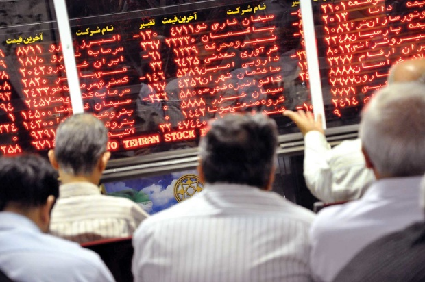

<div align="center">

</div>

> <p dir="RTL"> 
با استفاده از داده های OHLCV شرکت های تشکیل دهنده شاخص s&p500 و همچنین داده مربوط به شاخص های اقتصادی به سوالات زیر پاسخ دهید.
</p>

```{r preprocess, message=FALSE, warning=FALSE, code=readLines("./../Solutions/0.R"), include=FALSE, paged.print=FALSE}
```

```{r theme, message=FALSE, warning=FALSE, code=readLines("./../Solutions/theme.R"), include=FALSE, paged.print=FALSE}
```

***

<p dir="RTL">
۱. چه شرکتی رکورددار کسب بیشترین سود در بازه یکساله، دو ساله و پنج ساله می باشد؟ این سوال را برای بخش های مختلف مورد مطالعه قرار دهید و رکورددار را معرفی کنید. (برای این کار به ستون sector داده constituents مراجعه کنید.) برای هر دو قسمت نمودار سود ده شرکت و یا بخش برتر را رسم نمایید.
</p>

```{r 1, echo=TRUE, fig.height=9, fig.width=16, message=FALSE, warning=FALSE, code=readLines("./../Solutions/1.R"), paged.print=FALSE}
```

***

<p dir="RTL">
۲. یک اعتقاد خرافی می گوید خرید سهام در روز سیزدهم ماه زیان آور است. این گزاره را مورد ارزیابی قرار دهید.
</p>

<p dir="RTL">
از تست ویلکاکسان استفاده می کنیم برای بررسی این ادعا.
نتیجه می شود که شواهد کافی برای رد این مدعا وجود ندارد.
</p>

```{r 2, echo=TRUE, fig.height=9, fig.width=16, message=FALSE, warning=FALSE, code=readLines("./../Solutions/2.R"), paged.print=FALSE}
```

***

<p dir="RTL">
۳. رکورد بیشترین گردش مالی در تاریخ بورس برای چه روزی بوده است و چرا!!!
</p>

```{r 3, echo=TRUE, fig.height=9, fig.width=16, message=FALSE, warning=FALSE, code=readLines("./../Solutions/3.R"), paged.print=FALSE}
```

<p dir="RTL">
در این روز بازارهای آمریکا فروش بی سابقه ای داشته اند.
دلیل این امر هم چند دلیل است که دست به دست هم داده اند.
اولی سقوط شاخص سهام در چین که به دوشنبه ی سیاه معروف شد.
سقوط بازارهای اروپا مثل آلمان.
قیمت مواد خام به کمترین نرخ از سال ۱۹۹۹ رسیده بود.
و افزایش نرخ بهره در آمریکا از ۰.۲۵ درصد به ۰.۵ درصد.
</p>

***

<p dir="RTL">
۴. شاخص AAPL که نماد شرکت اپل است را در نظر بگیرید. با استفاده از رگرسیون خطی یک پیش کننده قیمت شروع (open price) بر اساس k روز قبل بسازید. بهترین انتخاب برای k چه مقداری است؟ دقت پیش بینی شما چقدر است؟
</p>

```{r 4, echo=TRUE, fig.height=9, fig.width=16, message=FALSE, warning=FALSE, code=readLines("./../Solutions/4.R"), paged.print=FALSE}
```

***

<p dir="RTL">
۵. بر روی داده های قیمت شروع شرکت ها الگوریتم pca را اعمال کنید. نمودار تجمعی درصد واریانس بیان شده در مولفه ها را رسم کنید. سه مولفه اول چند درصد از واریانس را تبیین می کند؟
</p>

```{r 5, echo=TRUE, fig.height=9, fig.width=16, message=FALSE, warning=FALSE, code=readLines("./../Solutions/5.R"), paged.print=FALSE}
```

***

<p dir="RTL">
۶. برای هر نماد اطلاعات بخش مربوطه را از داده constituents استخراج نمایید. برای هر بخش میانگین روزانه قیمت شروع شرکت های آن را محاسبه کنید. سپس با استفاده از میانگین به دست آمده  داده ایی با چند ستون که هر ستون یک بخش و هر سطر یک روز هست بسازید. داده مربوط را با داده شاخص های اقتصادی ادغام کنید. بر روی این داده pca بزنید و نمودار biplot آن را تفسیر کنید.
</p>

```{r 6, echo=TRUE, fig.height=9, fig.width=16, message=FALSE, warning=FALSE, code=readLines("./../Solutions/6.R"), paged.print=FALSE}
```

<p dir="RTL">
اگر به نمودار نگاه کنیم نتیجه ای که می توان گرفت این است که افزیش قیمت در بخش های مختلف باعث می شود که سهام در سایر بخش ها هم بالا برود،
یا حداقل این همزمانی زیاد رخ می دهد.
همچنین زیاد شدن قیمت های سهام مطابق انتظار با شاخص بورس نیز رابطه ی مستقیم دارد.
همچنین راستای مربوط به همه ی این ها با بردار اول
pca
همراستاست که نشان می دهد یکی از مهم ترین اول تمیز روز ها هم همین وقایع است.
نکته ی جالب دیگر این است که شرکت های حوزه ی
`finance`
رفتاری برخلاف بقیه دارد.
</p>
***

<p dir="RTL">
۷. روی همه اطلاعات (OHLCV) سهام اپل الگوریتم PCA را اعمال کنید. سپس از مولفه اول برای پیش بینی قیمت شروع سهام در روز آینده استفاده کنید. به سوالات سوال ۴ پاسخ دهید. آیا استفاده از مولفه اول نتیجه بهتری نسبت به داده open price برای پیش بینی قیمت دارد؟
</p>

```{r 7, echo=TRUE, fig.height=9, fig.width=16, message=FALSE, warning=FALSE, code=readLines("./../Solutions/7.R"), paged.print=FALSE}
```

<p dir="RTL">
خیر نتیجه ی بهتری ندارد.
</p>

***

<p dir="RTL">
۸. نمودار سود نسبی شاخص s&p500 را رسم کنید. آیا توزیع سود نرمال است؟(از داده indexes استفاده کنید.)
با استفاده از ده مولفه اول سوال پنج آیا می توانید سود و ضرر شاخص s&p500 را برای روز آينده پیش بینی کنید؟ از یک مدل رگرسیون لاجستیک استفاده کنید. درصد خطای پیش بینی را به دست آورید.
</p>

<p dir="RTL">
خیر نرمال نیستند از نمودار
qqplot
و تست
shapiro
برای بررسی این موضوع استفاده می کنیم.
</p>

<p dir="RTL">
بله می توان پیش بینی کرد ولی درصد خطای نوع اول ما خیلی زیاد است.
</p>

```{r 8, echo=TRUE, fig.height=9, fig.width=16, message=FALSE, warning=FALSE, code=readLines("./../Solutions/8.R"), paged.print=FALSE}
```


***

<p dir="RTL"> 
۹. عکسی که در ابتدای متن آمده را در نظر بگیرید. با استفاده از pca عکس را فشرده کنید. سپس نمودار حجم عکس فشرده بر حسب تعداد مولفه اصلی را  رسم کنید. بهترین انتخاب برای انتخاب تعداد مولفه ها در جهت فشرده سازی چه عددی است؟
</p>

```{r 9, echo=TRUE, fig.height=9, fig.width=16, message=FALSE, warning=FALSE, code=readLines("./../Solutions/9.R"), paged.print=FALSE}
```


<p dir="RTL"> 
اگر که گیف حاصل را تماشا کنیم خواهیم دید که از ۹۰ مولفه تا ۳۰۰ مولفه تغییر چندانی در کیفیت عکس مشاهده نمی شود.
پس چیزی حدود ۹۰ مولفه برای فشرده سازی این عکس مناسب است.
</p>
***

<p dir="RTL"> 
۱۰. پنج ایده جالبی که روی داده های مالی بالا می توانستیم پیاده کنیم را بیان کنید. (ایده کافی است نیازی به محاسبه بر روی داده نیست.)
</p>

<p dir="RTL"> 
۱. بررسی 
کریلیشن حجم مبادلات شرکت ها با هم.
یعنی اینکه چه شرکت هایی هستند که در یک روز با هم حجم مبادلاتشان افزایش می یابد و با هم کاهش می یابد.
</p>

<p dir="RTL"> 
۲. اگر که برای بخش های مختلف مدل های پیش بینی سود و زیان بسازیم، کدام بخش ها کمترین و بیشترین خطا را در مدلمان خواهند داشت؟
یا معادلا کدام یک از بخش ها با رگرسیون خطی تعمیم یافته بهتر مدل می شود و کدام بدتر؟
</p>

<p dir="RTL"> 
۳. کدام شرکت ها سهامشان بیشترین روند صعودی را داشته است؟ یا معادلن در کمترین تعداد روزهای ممکن نزول داشته اند؟
</p>

<p dir="RTL"> 
۴. درست کردن یک مدل برای تشخیص بخش یک شرکت از روی داده ی قیمت و مبادلات سهام آن در روز های مختلف.
</p>

<p dir="RTL"> 
۵. کشیدن نمودار شاخص
`S&P-500`
و مشخص کردن رییس جمهورهای آمریکا در آن.
</p>